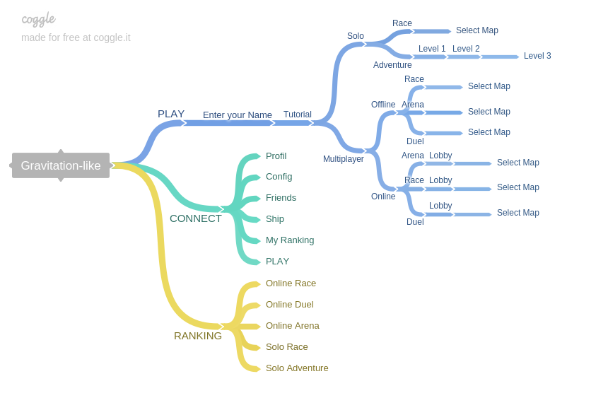

# Gravitation
## Sommaire

* Définition globale du projet
* Définition de la cible
* Arborescence du site

## Définition globale du projet

Gravitation est un jeu vidéo entièrement accessible par navigateur internet qui peut se jouer aussi bien en solo, qu'en multijoueur local (offline) ou à distance (online).
Il sera compatible avec tout les navigateurs récent (Chrome, Chromium, Firefox, Safari, Opera, Edge).
Et devra être jouable sur un ordinateur de bureau, mais aussi sur tablet et smartphone.
## Définition de la cible
## Arborescence du site

